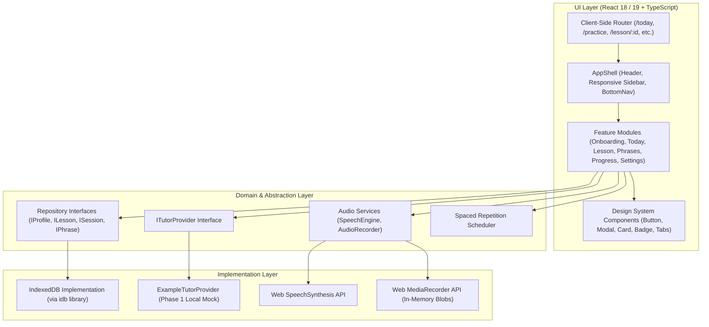

# System Architecture — Daily English

## 1. ภาพรวมสถาปัตยกรรม (High-Level Architecture)

Daily English ใน Phase 1 ถูกออกแบบตามแนวคิด **Local-First Single Page Application (SPA)** โดยไม่มี Backend หรือเซิร์ฟเวอร์ภายนอก เพื่อให้มั่นใจในเรื่องความเป็นส่วนตัว (Privacy), การทำงานที่รวดเร็ว (Zero Network Latency), และความเรียบง่ายในการใช้งาน



---

## 2. โครงสร้างโฟลเดอร์ (Directory Structure)

```
daily-english/
├── docs/                        # เอกสารระบบ (PRD, UX-UI, ARCHITECTURE, DATA-MODEL, etc.)
├── public/                      # Static assets (Favicon, manifest, fonts)
├── src/
│   ├── components/
│   │   ├── layout/              # AppShell, Desktop Sidebar, Mobile BottomNav
│   │   └── ui/                  # Reusable accessible controls (Button, Card, Modal, Badge, Toast)
│   ├── data/
│   │   └── lessons/             # Seed lessons (Design feedback, Daily life, Gaming)
│   ├── features/
│   │   ├── onboarding/          # Onboarding questionnaire & preferences
│   │   ├── today/               # Daily dashboard & 1-click launcher
│   │   ├── practice/            # Lesson catalog, search, and category filters
│   │   ├── lesson/              # 5-step lesson player (Listen, Repeat, Use it, Review, Summary)
│   │   ├── phrases/             # Phrase bank management, flashcards, CRUD
│   │   ├── progress/            # Statistics, active time, 7-day view, history
│   │   └── settings/            # Profile settings, JSON Export/Import, Reset
│   ├── lib/
│   │   ├── storage/             # IndexedDB wrapper and Repository implementations
│   │   ├── audio/               # SpeechSynthesis & MediaRecorder helpers
│   │   ├── review/              # Spaced repetition scheduling & timezone calculators
│   │   └── ai/                  # Tutor provider interfaces & Phase 1 Example provider
│   ├── types/                   # Shared TypeScript interfaces (Profile, Lesson, Session, Phrase)
│   ├── App.tsx                  # Root application router & providers
│   ├── index.css                # Design tokens & base stylesheet
│   └── main.tsx                 # React entrypoint
├── tests/                       # Unit and integration test suites
├── index.html
├── package.json
├── tsconfig.json
├── vite.config.ts
└── .env.example
```

---

## 3. ขอบเขตโมดูลและการแยกหน้าที่ (Separation of Concerns)

### 3.1 Data Repositories Pattern
UI Component จะไม่เรียก `indexedDB` โดยตรง แต่จะเรียกผ่าน Interface เสมอ:

```typescript
// src/lib/storage/interfaces.ts
export interface IProfileRepository {
  getProfile(): Promise<Profile>;
  updateProfile(profile: Partial<Profile>): Promise<Profile>;
}

export interface ILessonRepository {
  getAllLessons(): Promise<Lesson[]>;
  getLessonById(id: string): Promise<Lesson | null>;
}

export interface ISessionRepository {
  getActiveSession(lessonId: string): Promise<Session | null>;
  saveSession(session: Session): Promise<void>;
  completeSession(session: Session): Promise<void>;
  getAllCompletedSessions(): Promise<Session[]>;
}

export interface IPhraseRepository {
  getAllPhrases(): Promise<Phrase[]>;
  getDuePhrases(nowUtc: string): Promise<Phrase[]>;
  savePhrase(phrase: Phrase): Promise<void>;
  savePhrases(phrases: Phrase[]): Promise<void>;
  deletePhrase(id: string): Promise<void>;
}
```
**ประโยชน์**: หากในอนาคตต้องการเปลี่ยนไปใช้ Cloud Sync (เช่น Supabase หรือ Firebase) สามารถสร้าง Repository Class ใหม่มาแทนที่ได้ทันทีโดยไม่ต้องแก้ไขหน้าจอ UI

### 3.2 Tutor Provider Abstraction
```typescript
// src/lib/ai/types.ts
export interface TextFeedbackResponse {
  source: 'example' | 'ai';
  meaningUnderstood: boolean | null;
  correctedSentence: string | null;
  explanationTh: string;
  corrections: string[];
  suggestedRetry: string | null;
}

export interface ITutorProvider {
  getFeedback(questionEn: string, userAnswer: string): Promise<TextFeedbackResponse>;
}
```
- ใน **Phase 1**: ใช้ `ExampleTutorProvider` ซึ่งจะส่งคืนตัวอย่างคำตอบและ Self-check guideline โดยระบุ `source: 'example'` ชัดเจน
- ใน **Phase 2**: สามารถสลับไปใช้ `RemoteTutorProvider` ที่เรียกผ่าน Secure Backend API ได้โดยไม่ต้องแก้ UI

### 3.3 Audio Engine & Resource Cleanup
- **Web SpeechSynthesis**: จัดการเลือกเสียงภาษาอังกฤษ (en-US / en-GB) ที่ดีที่สุดในเครื่อง ปรับ playback rate (0.75x, 1x) และแจ้งเตือน Fallback กรณีเครื่องไม่มีเสียง
- **MediaRecorder**:
  - ขอไมโครโฟนเมื่อผู้ใช้กดอัดครั้งแรกเท่านั้น
  - เก็บเสียงในหน่วยความจำ (Blob) ของแท็บปัจจุบัน
  - เคลียร์ Audio Track (`track.stop()`) และเรียก `URL.revokeObjectURL()` เสมอเมื่อผู้ใช้ออกจากหน้าบทเรียนหรือเริ่มอัดใหม่ เพื่อป้องกัน Memory Leak

---

## 4. Time Tracking & Tab Visibility

เวลาในการเรียนรู้จะคำนวณจาก **เวลาที่ผู้ใช้อยู่หน้าบทเรียนจริง (Active Duration)** โดยมีระบบตรวจจับ:
1. ทำงานผ่าน `requestAnimationFrame` หรือ `setInterval` 1 วินาที
2. ตรวจสอบ `document.visibilityState` หากสถานะเป็น `hidden` (ผู้ใช้สลับแท็บ ย่อเบราว์เซอร์ หรือล็อกหน้าจอ) ตัวนับเวลาจะหยุดนับชั่วคราว
3. เมื่อสถานะกลับมาเป็น `visible` ตัวนับเวลาจะเริ่มนับต่อ
4. ค่าเวลาสะสมจะถูกบันทึกลงใน `activeDurationSeconds` ของ Session เพื่อใช้แสดงผลในหน้า Summary และหน้า Progress
